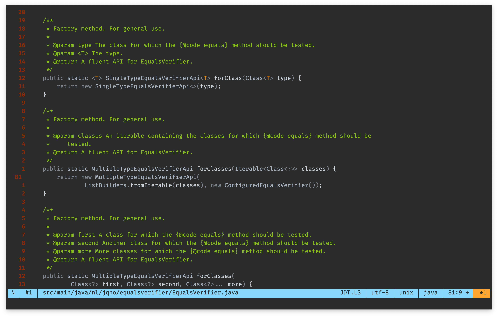
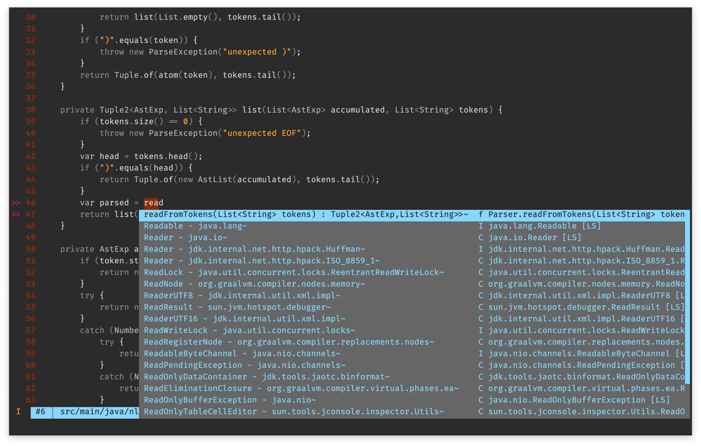
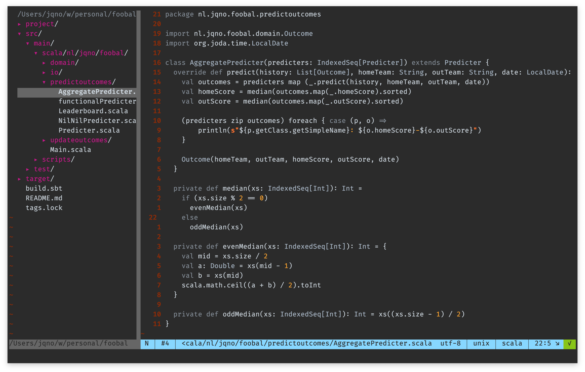

# Reversal.vim

A 'reversed' colorscheme for Vim, based on [Vim-RNB](https://github.com/romainl/vim-rnb).

I find that most color schemes emphasize the reserved words in a language by giving them bright colours. Reversal.vim does the opposite, and emphasizes identifiers instead. After all, that’s what the code is really about, right?

